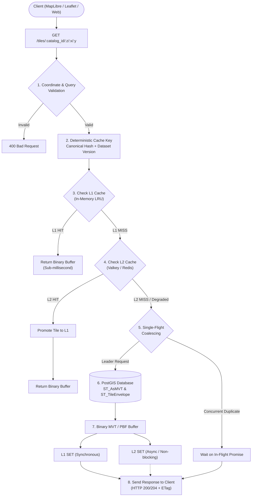
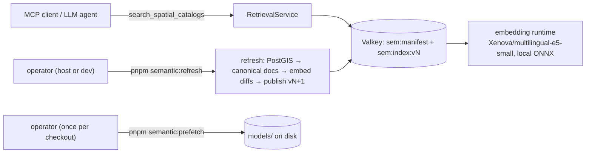

# Vector Tile Server

High-performance PostGIS-backed Vector Tile Server built with Hono, PostGIS, TypeScript, and OpenAPI.

## Features

- **Dynamic Vector Tile Generation (MVT / PBF)** using PostGIS `ST_AsMVT` & `ST_TileEnvelope`.
- **Multi-Layer Support**: Renders multiple geometry columns per table as distinct layers in single vector tiles.
- **TileJSON 3.0.0 Metadata**: Auto-discovery of spatial tables/views and fields with bounding box calculation.
- **SQL WHERE Filtering**: Safe Pratt-parsed query sanitizer with column whitelisting and type coercion.
- **OpenAPI, Scalar & LLM Docs**: Auto-generated interactive API documentation at `/docs`, OpenAPI JSON schema at `/openapi`, and Markdown specification for LLMs at `/llms.txt` (via `@scalar/openapi-to-markdown`).
- **API Key Security**: Optional API Key authentication via `X-API-Key` header.
- **Full Test Suite**: Comprehensive unit & integration testing via Vitest.

## Quick Start

```bash
# Install dependencies
pnpm install

# Start database and cache containers
docker compose up db valkey -d

# Run dev server
pnpm dev
```

Visit the interactive API documentation at [http://localhost:3000/docs](http://localhost:3000/docs) or LLM Markdown at [http://localhost:3000/llms.txt](http://localhost:3000/llms.txt).

## Scripts

```bash
# Typecheck, lint, and run tests
pnpm check

# Run Vitest unit tests
pnpm test

# Build production bundle
pnpm build

# Generate random API key
pnpm generate:api-key

# Seed sample PostGIS data
pnpm seed
# or
pnpm seed:sample-data
```

## Docker Deployment

To deploy the entire stack (Vector Tile Server + PostGIS + Valkey) using Docker Compose:

```bash
# Copy production environment template
cp .env.production.example .env

# Build and start all services
docker compose up --build -d

# View logs
docker compose logs -f app
```

## Map hardening (Wave 2A)

- **Allowlists** (`ALLOWED_SCHEMAS`, `ALLOWED_CATALOGS`): unauthorized schema/catalog discovery, TileJSON detail, and tiles return 404 (no catalog enumeration). Empty = all allowed (baseline).
- **Stable feature IDs** (`STABLE_ID_COLUMNS`): explicit `catalog:column` mapping first, single-column primary key fallback, never `ctid`. TileJSON carries `featureIdProperty`/`highlightSupported`; MVT sets the external feature id from that column and removes it from properties.
- **`where`** uses the existing sanitizer; max 1000 chars.
- **CORS** locked to `CORS_ALLOWED_ORIGINS` or rejected for cross-origin browser reads. Cache/security headers set.
- Decoded-MVT integration test: `RUN_VT_INTEGRATION=1 pnpm test tests/mvt-feature-id.integration.test.ts` (needs live PostGIS sample DB).
---

## 2-Level Vector Tile Cache Architecture

The server features a production-grade **2-level caching architecture** designed for high concurrency, low latency, and zero tile corruption:



### Cache Features

- **Raw Binary Buffer Storage**: Tiles are stored as raw `Buffer` payloads directly in memory (L1) and Valkey (L2) with zero JSON or base64 overhead.
- **Deterministic & Versioned Cache Keys**:
  - Format: `mvt:v1:{layer}:d{datasetVersion}:z{z}:x{x}:y{y}:q{queryHash}[:t{tenantId}]`
  - Canonical query sorting ensures `?status=active&year=2026` and `?year=2026&status=active` generate identical cache keys.
  - Coordinate validation prevents cache penetration from malformed coordinates.
- **Single-Flight Request Coalescing**:
  - Prevents cache stampedes by coalescing simultaneous cold misses for the same tile into **1 PostGIS query per process**.
- **Valkey Resiliency & Circuit Breaker**:
  - Configurable connect and command timeouts.
  - Circuit breaker (`HEALTHY` $\rightarrow$ `DEGRADED` $\rightarrow$ `PROBING`) protects latency during remote cache outages.
  - If Valkey is down or unconfigured, the server seamlessly degrades to L1 LRU + PostGIS without failing requests.
- **HTTP Conditional Requests & Observability**:
  - Deterministic `ETag` generation and `If-None-Match` support (`304 Not Modified`).
  - Prometheus-compatible metrics endpoint at `GET /metrics` (`Accept: text/plain` or `application/json`).
  - Cache bypass support via `?cache=false` or `Cache-Control: no-cache`.

### Cache Configuration (`.env`)

```env
# Master Cache Toggle
MVT_CACHE_ENABLED=true

# L1 In-Process LRU Cache
MVT_CACHE_L1_ENABLED=true
MVT_CACHE_L1_MAX_ITEMS=10000
MVT_CACHE_L1_MAX_SIZE_MB=256
MVT_CACHE_L1_TTL_SECONDS=60          # Default: 1 minute (60s)

# L2 Valkey / KeyDB Remote Cache
# (If VALKEY_HOST or VALKEY_URL is omitted, L2 is disabled automatically)
VALKEY_HOST=localhost
VALKEY_PORT=6379
# VALKEY_PASSWORD=vtserver
# VALKEY_URL=redis://localhost:6379
VALKEY_CONNECT_TIMEOUT_MS=1000
VALKEY_COMMAND_TIMEOUT_MS=500

MVT_CACHE_L2_ENABLED=true
MVT_CACHE_L2_TTL_SECONDS=60          # Default: 1 minute (60s)
MVT_CACHE_L2_EMPTY_TTL_SECONDS=15    # Negative/empty tile caching TTL
MVT_CACHE_TTL_JITTER_SECONDS=10      # Anti-avalanche jitter window

# Stampede Prevention & Debugging
MVT_CACHE_SINGLE_FLIGHT_ENABLED=true # Process-local request coalescing
MVT_CACHE_DEBUG_HEADERS=false        # Injects X-MVT-Cache header
```

### Benchmark Suite

Run the built-in benchmark script to measure throughput, latency, and DB query reductions across all cache modes:

```bash
pnpm tsx scripts/benchmark-cache.ts
```

---

## Production Reverse Proxy (Nginx)

The server supports deployment under a **dedicated subdomain** or a **subpath** by setting the `APP_BASE_URL` environment variable.

### 1. Subdomain Deployment (`tiles.yourdomain.com`)

Set your environment variable:
```env
APP_BASE_URL="https://tiles.yourdomain.com"
```

Nginx configuration (`/etc/nginx/sites-available/tiles.yourdomain.com`):
```nginx
server {
    listen 80;
    server_name tiles.yourdomain.com;
    return 301 https://$host$request_uri;
}

server {
    listen 443 ssl http2;
    server_name tiles.yourdomain.com;

    # SSL certificates (e.g. Let's Encrypt)
    ssl_certificate /etc/letsencrypt/live/tiles.yourdomain.com/fullchain.pem;
    ssl_certificate_key /etc/letsencrypt/live/tiles.yourdomain.com/privkey.pem;

    location / {
        proxy_pass http://127.0.0.1:3000;
        proxy_http_version 1.1;

        proxy_set_header Host $host;
        proxy_set_header X-Real-IP $remote_addr;
        proxy_set_header X-Forwarded-For $proxy_add_x_forwarded_for;
        proxy_set_header X-Forwarded-Proto $scheme;

        # Disable buffering for low-latency tile streaming
        proxy_buffering off;
    }
}
```

---

### 2. Subpath Deployment (`yourdomain.com/gis/` or `yourdomain.com/tiles/`)

Set your environment variable to include the subpath:
```env
APP_BASE_URL="https://yourdomain.com/gis"
```

Nginx configuration (`/etc/nginx/sites-available/yourdomain.com`):
```nginx
server {
    listen 443 ssl http2;
    server_name yourdomain.com;

    # SSL certificates
    ssl_certificate /etc/letsencrypt/live/yourdomain.com/fullchain.pem;
    ssl_certificate_key /etc/letsencrypt/live/yourdomain.com/privkey.pem;

    # Note the trailing slashes on both location and proxy_pass:
    # This strips the `/gis/` prefix when forwarding to the vector tile server.
    location /gis/ {
        proxy_pass http://127.0.0.1:3000/;
        proxy_http_version 1.1;

        proxy_set_header Host $host;
        proxy_set_header X-Real-IP $remote_addr;
        proxy_set_header X-Forwarded-For $proxy_add_x_forwarded_for;
        proxy_set_header X-Forwarded-Proto $scheme;

        proxy_buffering off;
    }
}
```

> [!TIP]
> Setting `APP_BASE_URL` ensures that TileJSON metadata (`"tiles": ["https://yourdomain.com/gis/tiles/..."]`), OpenAPI schemas, and Scalar API docs at `/gis/docs` resolve all paths accurately across subpaths and subdomains.

---

## Model Context Protocol (MCP) Server

Vector Tile Server includes a built-in **MCP (Model Context Protocol) Server** supporting both **SSE / HTTP Stream Transport** and **Stdio Transport**. This allows AI Assistants (Cursor, Claude Desktop, Antigravity) and external AI Agent frameworks (such as **Mastra** or **GeoLibre**) to directly discover spatial layers, perform sanitized spatial queries, inspect binary MVT tiles, generate MapLibre styles, and manage tile cache.

### Available MCP Tools

| Tool Name | Description |
| :--- | :--- |
| `list_spatial_catalogs` | Discovers all PostGIS tables, views, and geometry layers. |
| `get_catalog_schema` | Inspects columns, data types, SRID, and table descriptions. |
| `get_tilejson` | Retrieves TileJSON 3.0.0 metadata with calculated bounds & center. |
| `latlon_to_tile` | Converts `(lat, lon, zoom)` to XYZ tile coordinates. |
| `tile_to_bbox` | Converts XYZ tile coordinates to WGS84 bounding box `[minLon, minLat, maxLon, maxLat]`. |
| `query_layer_features` | Queries spatial features with Pratt-sanitized WHERE filter returning GeoJSON. |
| `get_attribute_statistics` | Computes column stats & distinct values for styling and filtering. |
| `inspect_mvt_tile` | Decodes binary `.mvt` / `.pbf` tiles to inspect layers, feature counts, and geometry types. |
| `generate_tile_url` | Generates XYZ template URLs with optional WHERE filters and auth guidance. |
| `generate_maplibre_style` | Generates MapLibre GL JS / GeoLibre layer style JSON (fill, line, circle). |
| `export_geolibre_config` | Generates ready-to-import configuration for GeoLibre workspace. |
| `get_cache_and_server_metrics` | Returns L1/L2 cache hit ratios, memory, Valkey status, and Prometheus metrics. |
| `purge_layer_cache` | Invalidates cached vector tiles by bumping dataset version and clearing L1 LRU. |
| `search_spatial_catalogs` | Semantically searches the spatial catalog index and returns layers ranked by relevance (see [Semantic Spatial Catalog Search](#semantic-spatial-catalog-search)). |

### Authentication & Security (API Key)

When `API_KEY` is configured in your `.env` file, all MCP SSE endpoints (`/mcp/sse` and `/mcp/messages`) are protected with rate-limiting and authentication.

You can authenticate using any of the following methods:
1. **Query Parameter**: `?apiKey=<YOUR_API_KEY>` or `?api_key=<YOUR_API_KEY>` *(Recommended for browser EventSource / MCP Inspector)*.
2. **Header `X-API-Key`**: `X-API-Key: <YOUR_API_KEY>`.
3. **Header `Authorization`**: `Authorization: Bearer <YOUR_API_KEY>`.

---

### Testing MCP with UI (MCP Inspector)

The official **MCP Inspector** tool provides a web UI to test and inspect all tools interactively:

```bash
# Important: Always wrap the URL in quotes in zsh/bash to prevent globbing the `?` query character
npx @modelcontextprotocol/inspector "http://localhost:3000/mcp/sse?apiKey=YOUR_API_KEY"
```

Or test with custom headers via cURL:
```bash
# Test SSE stream handshake
curl -N -i -H "X-API-Key: YOUR_API_KEY" http://localhost:3000/mcp/sse

# Or via query parameter
curl -N -i "http://localhost:3000/mcp/sse?apiKey=YOUR_API_KEY"
```

---

### Connecting External Mastra Project (SSE Transport)

In your external **Mastra** project, connect via `@mastra/mcp`:

```typescript
import { MCPClient } from "@mastra/mcp";
import { Agent } from "@mastra/core/agent";

export const mcpClient = new MCPClient({
  id: "vector-tile-client",
  servers: {
    vectorTileServer: {
      // Option A: Via URL Query Parameter (Recommended)
      url: new URL("http://localhost:3000/mcp/sse?apiKey=" + process.env.VECTOR_TILE_API_KEY),

      // Option B: Via Custom Headers
      // url: new URL("http://localhost:3000/mcp/sse"),
      // headers: {
      //   "X-API-Key": process.env.VECTOR_TILE_API_KEY,
      // },
    },
  },
});

export async function getGisAgent() {
  const tools = await mcpClient.getTools();
  return new Agent({
    name: "GIS Analyst",
    instructions: "You are a GIS assistant analyzing PostGIS spatial layers and vector tiles...",
    tools: { ...tools },
  });
}
```

---

### Running MCP Locally via Stdio (Cursor / Claude Desktop)

```bash
# Start MCP server over stdio
pnpm mcp
```

Or add to `.cursor/mcp.json` / Claude Desktop config:
```json
{
  "mcpServers": {
    "vector-tile-server": {
      "command": "pnpm",
      "args": ["mcp"]
    }
  }
}
```

---

### Multi-Instance & Clustered Deployment (Docker / PM2 / Nginx)

When deploying multiple instances of the server (e.g. `docker compose up --scale app=3`, Kubernetes replicas, or behind an Nginx load balancer):

> [!IMPORTANT]
> **Sticky Sessions Required for SSE Transport**:
> The MCP SSE protocol operates via a 2-step lifecycle:
> 1. `GET /mcp/sse` establishes the event stream and returns an in-memory `sessionId`.
> 2. `POST /mcp/messages?sessionId=...` delivers tool call commands to that specific session.
>
> If you load-balance requests across multiple server instances using pure round-robin, the `POST` request might hit a different worker/container than the one holding the SSE connection in memory (resulting in `404: No active SSE transport session found`).

#### Recommended Nginx Configuration with Sticky Sessions (`ip_hash`)

```nginx
upstream tile_cluster {
    ip_hash; # Routes requests from the same client IP to the same worker instance
    server 127.0.0.1:3000;
    server 127.0.0.1:3001;
    server 127.0.0.1:3002;
}

server {
    listen 80;
    server_name tiles.yourdomain.com;

    location / {
        proxy_pass http://tile_cluster;
        proxy_http_version 1.1;
        proxy_set_header Connection '';
        proxy_set_header Host $host;
        proxy_set_header X-Real-IP $remote_addr;
        proxy_set_header X-Forwarded-For $proxy_add_x_forwarded_for;

        # Disable buffering and cache for realtime SSE streaming
        proxy_buffering off;
        proxy_cache off;
        proxy_read_timeout 86400s;
    }
}
```

| Deployment Architecture | MCP SSE Compatibility | Recommendation |
| :--- | :--- | :--- |
| **Single Container / Single Process** | ✅ **100% Compatible** | Zero extra setup needed. |
| **Docker Compose Replicas + Nginx / ALB** | ✅ **100% Compatible** | Enable `ip_hash;` or cookie-based Session Affinity on gateway. |
| **PM2 Clustered Mode** | ⚠️ **Requires Gateway** | Run individual PM2 fork instances across ports with Nginx `ip_hash`. |
| **Stdio Subprocess** | ✅ **100% Compatible** | Direct OS stdio pipe, completely isolated from network load balancers. |


---

## Semantic Spatial Catalog Search

The server can embed **spatial catalog layers** (PostGIS tables/views and their geometry columns) with a local multilingual ONNX model and answer natural-language queries like `cari lahan kosong` or `jalan banjir` with **ranked layer metadata** — never spatial features, never raw vectors. Search is served to MCP clients through the `search_spatial_catalogs` tool. The index, refresh, and model provisioning run as explicit CLI operations — there is **no automatic reindexing** and the model is **never downloaded at runtime**.



> [!NOTE]
> Ranking is an **exact cosine over unit-normalized 384-dim vectors** — a linear scan over the indexed layers. It is deliberately *not* an approximate (ANN/HNSW) index, so quality is exact but latency is linear in the number of layers.

### What gets indexed

Refresh (`pnpm semantic:refresh`) traverses every geometry object the tile server serves (`POSTGIS_SCHEMA` scope) **restricted to the allowlisted catalog surface** (`ALLOWED_SCHEMAS`/`ALLOWED_CATALOGS`; empty = all allowed), builds one canonical document per geometry **layer** (`schema.table.geometry` + geometry type + SRID + descriptions + fields, truncated deterministically at 1500 chars), and stores one 384-dim float32 vector per layer. Every search re-checks each candidate layer against the same allowlist at read time, so layers filtered out of the served surface never rank. The published index is **versioned and immutable**:

- `sem:manifest` — one key holding `{ version, layers[], documentCount, publishedAt, embeddingContract, sourceFingerprint, layerDetails }`.
- `sem:index:<version>:<schema>.<table>.<geometry>` — one key per layer holding the raw float32 vector.
- Readers resolve `version` from the manifest and `MGET` exactly its layer keys — no `SCAN`/`KEYS` on the search path. A version bump invalidates every version-scoped LRU cache entry naturally.

### Environment variables

All values are parsed by `src/libs/semantic/config.ts` (separate from the MVT cache env) and apply to the CLI scripts and the MCP tool. Defaults shown; setting a value outside its valid range fails startup with a descriptive error.

| Variable | Default | Valid range | Purpose |
| :--- | :--- | :--- | :--- |
| `SEMANTIC_MODEL_DIR` | `models/Xenova/multilingual-e5-small` | any readable path | Directory containing the packaged ONNX artifacts (`config.json`, `tokenizer.json`, `tokenizer_config.json`, `onnx/model.onnx`). Host + container. |
| `SEMANTIC_MODEL_ID` | `Xenova/multilingual-e5-small` | this exact value only | Embedding model id. The runtime **refuses** any other model. |
| `SEMANTIC_DIM` | `384` | this exact value only | Embedding dimension; anything else means a corrupted artifact. |
| `SEMANTIC_MAX_CONCURRENT_EMBEDDINGS` | `1` | integer `1..16` | Bounded concurrency for embedding inference (a FIFO queue bounds the rest). |
| `SEMANTIC_TOP_K_DEFAULT` | `10` | integer `1..100` | Default result count when a search omits `top_k`. |
| `SEMANTIC_TOP_K_MAX` | `100` | integer `1..100`, `>= SEMANTIC_TOP_K_DEFAULT` | Hard cap on `top_k` per request. |
| `SEMANTIC_DOCUMENT_CACHE_SIZE` | `4096` | integer `1..1_000_000` | LRU cap for cached per-layer document vectors. |
| `SEMANTIC_QUERY_CACHE_SIZE` | `1024` | integer `1..1_000_000` | LRU cap for cached query embeddings. |
| `SEMANTIC_RESULT_CACHE_SIZE` | `1024` | integer `1..1_000_000` | LRU cap for cached ranked results. |

The semantic stack needs the same PostGIS + Valkey connection env as the rest of the server (`POSTGIS_HOST`, `POSTGIS_PORT`, `POSTGIS_DB`, `POSTGIS_USER`, `POSTGIS_PASSWORD`, `POSTGIS_SCHEMA`, `VALKEY_HOST`, `VALKEY_PORT`, `VALKEY_PASSWORD`). If Valkey is unconfigured/disconnected the CLI fails fast and the MCP tool returns a typed `INDEX_UNAVAILABLE` error.

### Provisioning the model (once per checkout)

The ONNX artifacts are **not** in git and are **never downloaded at runtime**. Provision them once per checkout on the host:

```bash
pnpm semantic:prefetch
```

This writes `models/Xenova/multilingual-e5-small/` (model id + artifacts; ~466 MB) and a `.prefetch-verified.json` marker. Remote loading is hard-disabled in code (`env.allowRemoteModels = false`), so a missing artifact fails with a typed `MODEL_UNAVAILABLE` error naming the missing file — never a network attempt.

### Building the search index

```bash
pnpm semantic:refresh
```

Behavior (exit code non-zero on any typed failure — never a silent success):

- Traverses the PostGIS catalog, builds canonical documents, and diffs them **by fingerprint** (SHA-256 over the canonical passage + embedding contract) against the currently published version.
- **Changed/new layers** are re-embedded in one batched pipeline call; **unchanged layers** reuse the stored vector; **removed layers** disappear when the superseded namespace is purged.
- **No-op rerun** (byte-identical catalog **and** unchanged embedding contract): prints `catalog unchanged — version N still current (M layers, all reused)` and publishes nothing.
- First refresh publishes `v1`; a real change publishes `vN+1` (old namespace purged after the manifest overwrite — readers observe exactly one version).
- **Model contract change / artifact drift** (a re-provisioned or altered model under `SEMANTIC_MODEL_DIR` makes `modelContractFingerprint()` differ from the manifest's `embeddingContract`, even when the catalog is byte-identical): the next `pnpm semantic:refresh` detects the drift and triggers a **full reindex automatically** — every layer is re-embedded (0 reused — old vectors were produced by a different model), a new version is published, and the new `embeddingContract` is recorded in the manifest. This is the recovery path for the read-side `VERSION_MISMATCH`: no manual steps beyond running the refresh.
- **Read-side safety is unchanged**: until that refresh runs, searches compare the local fingerprint against the manifest and fail with `VERSION_MISMATCH` rather than ever ranking with mismatched model vectors.

**Reindex triggers** — a refresh re-embeds a layer when its fingerprint changes. The fingerprint covers the canonical passage + embedding contract, so it changes when any of the following changes:

| Trigger | Example |
| :--- | :--- |
| Table/geometry **description** (PostGIS `COMMENT`) | `COMMENT ON TABLE site_plan IS '...'` |
| **Fields** included in the document | adding/renaming a column |
| **Geometry type or geometry column** name | `geom` → `geom_4326` |
| **Schema/table** rename | `public.site_plan` → `gis.site_plan` |
| **Model contract** change | new model id, dimension, pooling, or normalize flag in `EMBEDDING_CONTRACT`, **or** re-provisioned/altered on-disk artifacts → `pnpm semantic:refresh` fully re-embeds under the new `embeddingContract` and republishes. |

Until that refresh runs, searches fail with `VERSION_MISMATCH`; running `pnpm semantic:refresh` records the new contract in the manifest and restores search (no other manual step).

### Benchmark

```bash
pnpm semantic:benchmark
```

Deterministic, exact-cosine benchmark against the **live** published index (start PostGIS + Valkey with `docker compose up db valkey -d` and refresh first). Fixed bilingual query set and iteration counts, concurrency 1. Measures index size (manifest + vector bytes, layer count), no-op refresh duration, query-embedding p50/p95, warm search p50/p95, and peak process RSS after warmup.

- Writes a machine-readable result to **`benchmark-results-semantic.json`** at the repo root (JSON: `index.*`, `refresh.*`, `embedding.p50Ms/p95Ms`, `search.p50Ms/p95Ms`, `rss.peakMbAfterWarmup`).
- Prints a human summary to stdout.
- States plainly in the output that the method is `exact-cosine-linear-scan` and is **not comparable to ANN/HNSW benchmarks**.
- Is a standalone ops script — **not** wired into the server or MCP request path.

### MCP tool contract

Tool name: `search_spatial_catalogs`. Description and input schema are served through the MCP `tools/list` endpoint (the semantic stack loads lazily on the first call — registering tools never loads the model).

**Input** (JSON object):

| Field | Type | Required | Constraints |
| :--- | :--- | :--- | :--- |
| `query` | string | yes | non-blank (trimmed); natural-language description of the layers to find |
| `top_k` | int | no | `1..100` (capped by `SEMANTIC_TOP_K_MAX`); defaults to `SEMANTIC_TOP_K_DEFAULT` |
| `schema` | string | no | only layers in this PostgreSQL schema (exact) |
| `geometry_type` | string | no | only layers whose PostGIS geometry type matches (trimmed, lowercased) |

**Request example**

```json
{
  "name": "tools/call",
  "arguments": {
    "name": "search_spatial_catalogs",
    "arguments": {
      "query": "jalan banjir",
      "top_k": 5,
      "schema": "public",
      "geometry_type": "MultiLineStringZ"
    }
  }
}
```

**Response** (`isError` absent) — a text content block with pretty-printed JSON:

```json
{
  "query": "jalan banjir",
  "total_results": 1,
  "results": [
    {
      "layer": { "schema": "public", "table": "site_plan", "geometry": "geom" },
      "catalogId": "public.site_plan",
      "geometryType": "MultiLineStringZ",
      "score": 0.8021173643355335,
      "tableDescription": "Rencana tapak pembangunan perumahan dan jalan lingkungan"
    }
  ]
}
```

Each `result` carries only `layer {schema, table, geometry}`, `catalogId` (`schema.table`), `geometryType`, `score` (cosine similarity, `0..1`), and optional `tableDescription` / `geometryDescription`. Results are sorted by score descending with a deterministic alphabetical tie-break on `layerId`; **raw vectors are never returned**.

**Error** (`isError: true`) — a text content block with JSON `{ code, message }`. A failure is never an empty `results` list:

| Code | Meaning / recovery |
| :--- | :--- |
| `INDEX_NOT_FOUND` | No manifest published yet — run `pnpm semantic:refresh`. |
| `INDEX_UNAVAILABLE` | Store unconfigured/disconnected, circuit `DEGRADED`, or a missing/corrupt vector — check Valkey, then `pnpm semantic:refresh`. |
| `MODEL_UNAVAILABLE` | Local model artifacts missing — run `pnpm semantic:prefetch` on the host (or bake the model into the image); the runtime never downloads. |
| `VERSION_MISMATCH` | Stored index was embedded under a model contract different from the local artifacts — if the current model is intended, run `pnpm semantic:refresh` (detects the drift and full-reindexes, publishing a new version under the new contract); if not, restore/provision the matching model and refresh. |
| `INVALID_ARGS` | Blank query / out-of-range `top_k` (invalid requests are also rejected by the Zod schema before the handler). |
| `EMBEDDING_FAILED` | Model output violates the contract — artifact may be corrupted; re-run `pnpm semantic:prefetch`. |
| `INTERNAL` | Unexpected failure. |

**Example error response**

```json
{
  "isError": true,
  "content": [
    {
      "type": "text",
      "text": "{ \"code\": \"INDEX_NOT_FOUND\", \"message\": \"no index manifest has been published yet\" }"
    }
  ]
}
```

### Metrics

The semantic stack keeps its own in-process Prometheus registry, separate from the MVT cache registry — every line is prefixed `semantic_search_*`. Counters/gauges (from `src/libs/semantic/metrics.ts`):

| Metric | Type | Meaning |
| :--- | :--- | :--- |
| `semantic_search_requests_total` | counter | Total search requests |
| `semantic_search_latency_milliseconds` | counter | Total search latency (ms) |
| `semantic_search_latency_average_milliseconds` | gauge | Average search latency (ms) |
| `semantic_search_embeddings_total` | counter | Embeddings computed (one per output vector) |
| `semantic_search_document_cache_hits_total` / `..._misses_total` | counter | Per-layer document LRU hits/misses |
| `semantic_search_query_cache_hits_total` / `..._misses_total` | counter | Query-embedding LRU hits/misses |
| `semantic_search_result_cache_hits_total` / `..._misses_total` | counter | Ranked-result LRU hits/misses |
| `semantic_search_errors_total{code="..."}` | counter | Errors labeled by code (`INDEX_UNAVAILABLE`, `MODEL_UNAVAILABLE`, `INVALID_ARGS`, `INDEX_NOT_FOUND`, `EMBEDDING_FAILED`, `VERSION_MISMATCH`, `INTERNAL`) |

> [!NOTE]
> The HTTP `GET /metrics` endpoint currently exposes the **MVT cache** registry (`mvt_cache_*`). `semantic_search_*` lines live in the separate `SemanticSearchMetrics` registry (`getSnapshot()` / `toPrometheus()` in `src/libs/semantic/metrics.ts`) which the refresh/benchmark CLIs read in-process; the semantic registry is not yet mounted on `GET /metrics`.

### Docker behavior

- **Base image**: both build stages run on `node:22-slim` (Debian glibc) because the ONNX runtime's native binding does not run on musl/Alpine.
- **Model is baked, not fetched**: the Dockerfile `COPY`s the host-provisioned `models/` tree into the image (`COPY models ./models`). There is no model-fetch path in the image and remote loading is hard-disabled, so a production container with the model present runs fully offline.
- **Non-root**: the runner drops to the stock `node` user (uid 1000); `/app` is chowned to it and model artifacts stay `644` (read-only — the runtime contract is read-only).
- **Semantic feature is not enabled by default in the image**: the image ships the code + model, but no semantic index is published until an operator runs a refresh **against the container's Valkey**. Run the refresh from the host (dev) or an operator container:
  ```bash
  # host/dev: point the refresh at the compose services, then it targets the
  # same Valkey the app container uses
  pnpm semantic:refresh
  ```
- `pnpm semantic:prefetch` is a **host/dev-only** command (it provisions `models/` on disk before a Docker build). It is deliberately not runnable inside the production image, which relies on the bake.
- The MCP stdio entrypoint `node dist/mcp/stdio.js` boots without loading the model; the model loads lazily on the first `search_spatial_catalogs` call.

### Rollback / disabling the semantic feature

Disabling the feature requires **no code change** — it is a configuration/deployment toggle:

1. **Simplest** — don't register the tool: the semantic tool is registered by the MCP server bootstrap. Remove the registration (or ship a build without `src/mcp/tools/semantic-search.tools.ts` wired in `src/mcp/index.ts`) and no client ever sees `search_spatial_catalogs`. The MVT tools are unaffected.
2. **Remove the index** — point the app at a Valkey with no `sem:manifest` (or delete it: `docker exec vector-tile-valkey valkey-cli -a <password> DEL sem:manifest`). Calls then fail with the typed `INDEX_NOT_FOUND` error instead of returning results.
3. **Remove the model** — delete/unset `SEMANTIC_MODEL_DIR` (or remove the `models/` tree). Calls fail fast with `MODEL_UNAVAILABLE`; nothing is downloaded to compensate.
4. **Stop refreshing** — since reindexing is purely operator-driven (`pnpm semantic:refresh`), simply not running it freezes the index at its current version forever. The MVT tile cache and all non-semantic MCP tools are completely independent of the semantic stack (lazy-imported only on first semantic call) and keep working while the feature is disabled.

> [!NOTE]
> Documented contract, defaults, and behavior reflect the shipped code. The disable paths above are operational toggles — no code change and no env-var rename is required to turn the feature off.
